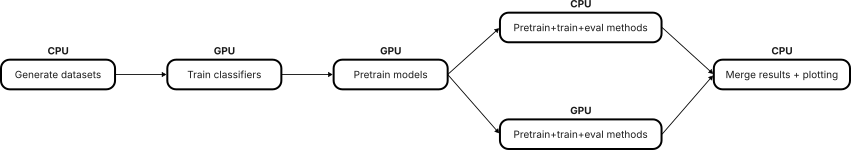

# Reproducing full results

This tutorial gives the Snakemake commands for reproducing the full benchmark
results with SLURM. The full benchmark creates many jobs, so running it on a
workstation is possible but not recommended.

Before running the commands, create SLURM workflow profiles for your cluster in
`extra/workflow/profiles/`. See [SLURM integration](slurm_integration.md) for
setup details.

The full pipeline mixes CPU-heavy and GPU-heavy stages. Running everything on
GPU wastes GPU time on lightweight jobs such as dataset generation, merging,
and plotting. Running everything on CPU makes neural-network training slow.
Instead, run the pipeline in the six stages below.

<p align="center">
  
</p>

Most stages use the `config/all` profile. The train/evaluate stages use
`config/cpu_methods` and `config/gpu_methods` to split the full method set
across CPU and GPU partitions. Set `device` manually to choose where each
stage runs.

To quickly verify that the pipeline works, add `smoke_test=true` to the
`--config` arguments. This keeps the same pipeline targets, but passes the
smoke-test setting to the scripts so they use faster validation settings. The
resulting metrics are only useful for checking execution and will not be
meaningful benchmark results.

## 1. Generate datasets (CPU)

```shell
uv run snakemake \
    --profile extra/workflow/profiles/config/all \
    all_generate_datasets \
    --workflow-profile extra/workflow/profiles/<your_cpu_cluster> \
    --config device=cpu
```

## 2. Train classifiers (GPU)

```shell
uv run snakemake \
    --profile extra/workflow/profiles/config/all \
    all_train_classifiers \
    --workflow-profile extra/workflow/profiles/<your_gpu_cluster> \
    --config device=cuda
```

## 3. Pretrain models (GPU)

```shell
uv run snakemake \
    --profile extra/workflow/profiles/config/all \
    all_pretrain_models \
    --workflow-profile extra/workflow/profiles/<your_gpu_cluster> \
    --config device=cuda
```

## 4. Train and evaluate CPU methods

This stage trains and evaluates the methods listed in
`extra/workflow/conf/methods/cpu.yaml` on the CPU partition.

```shell
uv run snakemake \
    --profile extra/workflow/profiles/config/cpu_methods \
    all_eval_methods \
    --workflow-profile extra/workflow/profiles/<your_cpu_cluster> \
    --config device=cpu
```

## 5. Train and evaluate GPU methods

This stage trains and evaluates the methods listed in
`extra/workflow/conf/methods/gpu.yaml` on the GPU partition.

```shell
uv run snakemake \
    --profile extra/workflow/profiles/config/gpu_methods \
    all_eval_methods \
    --workflow-profile extra/workflow/profiles/<your_gpu_cluster> \
    --config device=cuda
```

## 6. Merge results and plot (CPU)

After both evaluation stages finish, merge the results and create the final
plots.

```shell
uv run snakemake \
    --profile extra/workflow/profiles/config/all \
    all \
    --workflow-profile extra/workflow/profiles/<your_cpu_cluster> \
    --config device=cpu
```

The plotting step produces figures under `extra/output/plot_results/`.
